My key accomplishments were mainly as a coder, with me discovering how to code in Mermaid, like below:

```mermaid
flowchart LR
    %% GitHub Sources
    subgraph GitHub_Pages[GitHub: Open-Coding-Society/pages]
        A[Repo: pages]:::repo
    end

    subgraph GitHub_Template[GitHub:]
        T[Template Repo: student]:::repo
    end

    subgraph GitHub_Student[GitHub: rsharma5128/student]
        B[Repo: student]:::repo
    end

    %% Local Computer
    subgraph Local[Local Computer]
        subgraph opencs_dir[opencs/ directory]
            C[pages/]:::local
            Ccmd[VSCode Prep<br/><br/>./scripts/venv.sh<br/>source venv/bin/activate<br/>code .]:::cmd
        end
        subgraph user_dir[rsharma5128/ directory]
            D[student/]:::local
            Dcmd[VSCode Prep<br/><br/>./scripts/venv.sh<br/>source venv/bin/activate<br/>code .]:::cmd
        end
    end

    %% Arrows: cloning
    A -.->|clone/pull only| C
    B <--> |clone, pull & push| D

    %% Arrows: template relationship
    T -.->|template→created| B

    %% Arrows: commands
    C --> Ccmd
    D <--> Dcmd
    
```

My key accomplishments also include learning how to make a game using Javascript, like shown at [https://ahmad-se-tech.github.io/tablegroup/custompong](https://ahmad-se-tech.github.io/tablegroup/custompong), where I made a pong game with the help of my friend Matt.

Another key accomplishment I had as a coder was learning about one of the fundamentals which correlated to what I was doing and teaching about it, as seen [here](https://pages.opencodingsociety.com/js/nested-conditionals)

Also, I learned how to ask AI to achieve what I want to achieve without completely taking the backseat and making it do all the work.